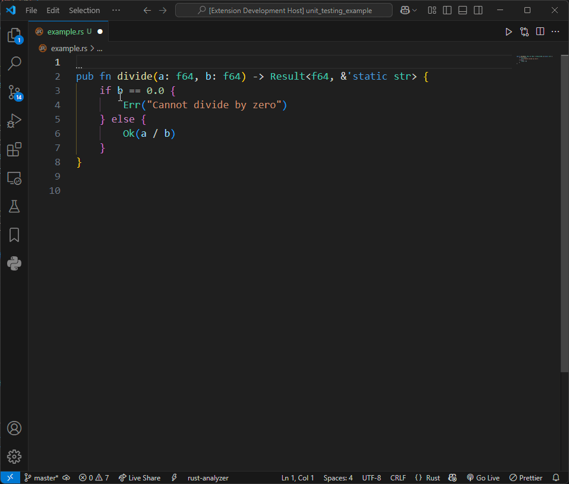
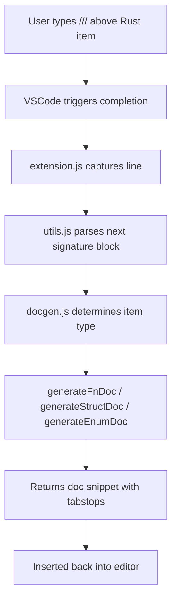
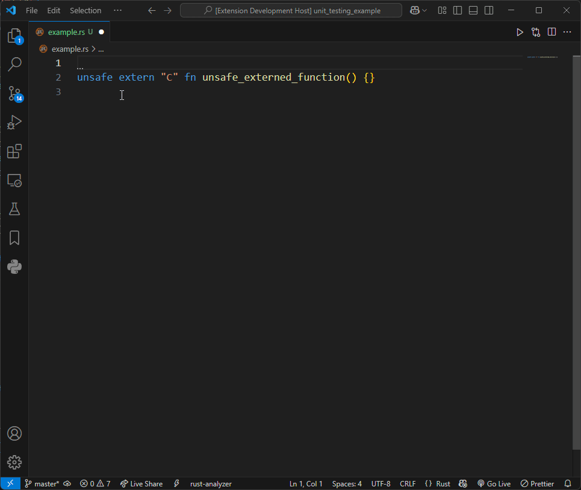
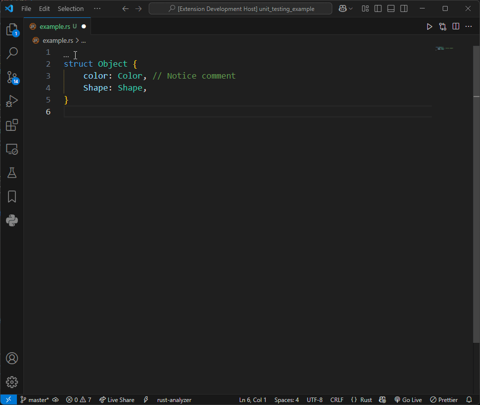
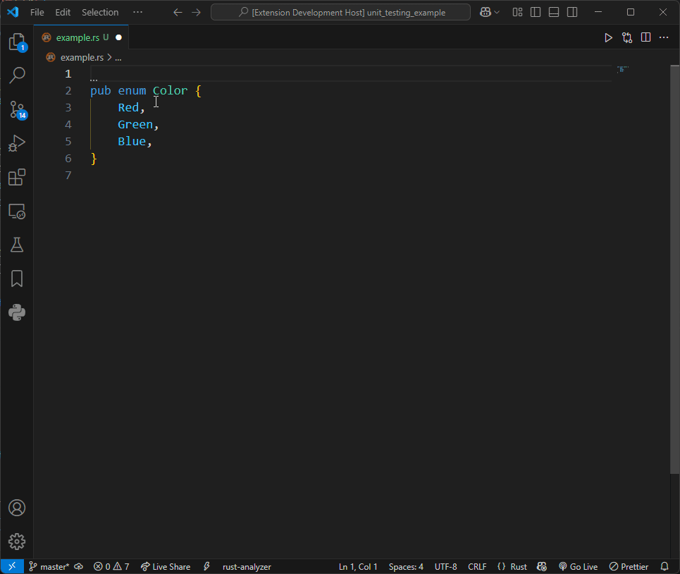
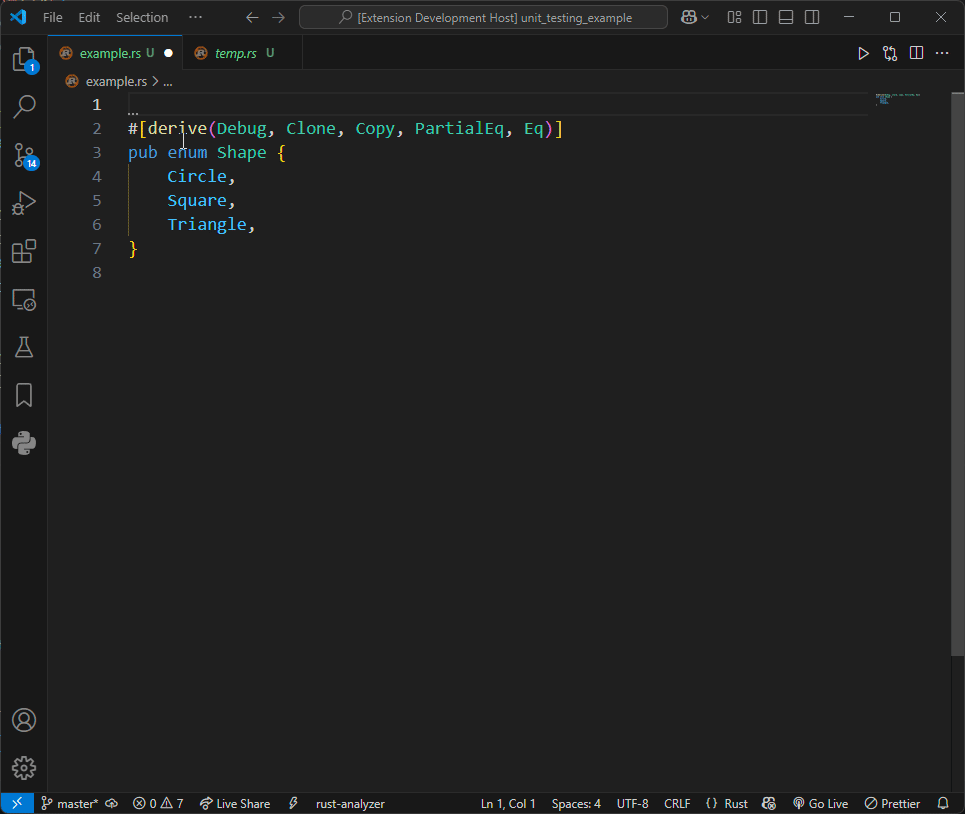

# Rust Doc String - VSCode Rust Docstring Generator

<p align="center">
  
  
  
  
  
</p>

**Rust Doc String** is a Visual Studio Code extension that generates professional, structured Rust documentation comments with a single trigger. It intelligently detects function, struct, and enum declarations and produces ready-to-edit `///` doc blocks tailored to each item.

<p align="center">
  
</p>

*See more demos below for unsafe functions, enums, enums with attributes, and structs under the [Example Output](#example-output) section.*

---

## Features

- Auto-generates Rust doc comments by typing `///` above a code item.
- Context-aware parsing for:
    - `fn` (with support fork *keyword modifiers* `pub`, `pub(...)`, `async`, `unsafe`, and `extern`)
      - Includes `# Arguments` and `# Returns` sections as appropriate.
    - `struct` (field and tuple style)
      - Includes `# Fields` section as appropriate.
    - `enum` (with unit, tuple, and struct variants)
      - Includes `# Variants` section as appropriate.
- Includes `# Safety`, `# Errors`, and `# Examples` sections as appropriate.
- Snippet tabstops make customization fast and consistent.
- Works seamlessly with multi-line signatures and skips attributes like `#[derive(...)]`.

---

## Quick Start

1. Install the extension from the VSCode Marketplace.
2. Open any Rust file.
3. Above a Rust item (function, struct, or enum), type ///.
4. Accept the completion snippet: "Generate Rust Doc Comment".
> Works out-of-the-box — no additional setup required.

---

## How It Works

RustDocString uses a signature parser (`utils.js`) to scan for the next Rust item and normalize its declaration. Then, depending on the item type:
- **Functions** → `gen_fn_doc.js`
- **Structs** → `gen_struct_doc.js`
- **Enums** → `gen_enum_doc.js`
These generate snippet-style doc blocks with Markdown formatting, code examples, and placeholder descriptions.



---

## Example Output:

*The commented section are generated from this extension. Notice the 'Describe this' within the comment.*

### Function

<p align="center">
  
</p>

```rust
/// Describe this function.
/// 
/// # Arguments
/// 
/// - `a` (`f64`) - Describe this parameter.
/// - `b` (`f64`) - Describe this parameter.
/// 
/// # Returns
/// 
/// - `f64` - Describe the return value.
/// 
/// # Examples
/// 
/// ```
/// use crate::...;
/// 
/// let _ = add();
/// ```
pub fn add(a: f64, b: f64) -> f64 {
    a + b
}
```

```rust
/// Describe this function.
/// 
/// # Safety
/// 
/// - **The caller must ensure that:**
///   - Any internal state or memory accessed by this function is in a valid state.
///   - Preconditions specific to this function's logic are satisfied.
///   - This function is only called in the correct program state to avoid UB.
/// - **This function is `unsafe` because:**
///   - Describe unsafe behavior.
/// 
/// # Examples
/// 
/// ```no_run
/// use crate::...;
/// 
/// // SAFETY: The Caller guarantees all invariants are met.
/// unsafe {
///   let _ = unsafe_externed_function();
/// }
/// ```
unsafe extern "C" fn unsafe_externed_function() {}
```

### Struct

<p align="center">
  
</p>

*Ignores attribute/decorators.*

```rust
/// Describe this struct.
/// 
/// # Fields
/// 
/// - `kind` (`IpAddrKind`) - Describe this field.
/// - `address` (`String`) - Describe this field.
/// 
/// # Examples
/// 
/// ```
/// use crate::...;
/// 
/// let s = IpAddr {
///     kind: value,
///     address: value,
/// };
/// ```
#[derive(Debug)]
struct IpAddr {
    kind: IpAddrKind,
    address: String,
}
```

### Enum

<p align="center">
  
  
</p>

```rust
/// Describe this enum.
/// 
/// # Variants
/// 
/// - `V4` - Describe this variant.
/// - `V6` - Describe this variant.
/// 
/// # Examples
/// 
/// ```
/// use crate::...;
/// 
/// let icaddrkind = IcAddrKind::V4;
/// match icaddrkind {
///     IcAddrKind::V4 => handle_unit,
///     IcAddrKind::V6 => handle_unit,
/// }
/// ```
pub enum IcAddrKind {
    V4,
    V6,
}
```

---

## Extension Settings

*No configuration options available yet.*
The extension is designed to work automatically when you type `///`.

> Planned: Enable/disable sections (e.g., examples, safety blocks) via settings.

## Requirements

- Visual Studio Code 1.80+ (recommended)
- Rust project (assumes `.rs` files)
- Rust code with valid syntax (detected using regex-based scanning)

---

## Installation

Via Marketplace (coming soon):

```bash
ext install rustdocstring
```

Or install from source:

```bash
git clone https://github.com/your-org/rustdocstring
cd rustdocstring
npm install
npm run compile
```

Then launch the extension in development mode with VSCode.

---

## Known Issues

- Does not yet support:
    - Traits
    - Unions
    - Individual enum variant document generation
      - *Creates the documentation for the enum as a whole. The `cargo doc` creates a separate section for enum variants.*

---

## Changelog

Check the [CHANGELOG.md](CHANGELOG.md) for any version changes.

---

## Related

- [Rustdoc Book](https://doc.rust-lang.org/rustdoc/) - Official guide
- [VS Code Snippets](https://code.visualstudio.com/docs/editor/userdefinedsnippets)

---

## Reporting Issues

- Report any issues on the github [GitHub Issues page](https://github.com/chrisdbeard/rustdocstring/issues). Use the `bug` or `feature request` labels where appropriate. Follow the template and add as much information as possible.

---

## Contributing

The source code is available on [GitHub](https://github.com/chrisdbeard/rustdocstring), and contributions of all kinds are welcome — whether it's filing an issue, requesting a feature, or submitting a pull request.

- Found a bug or have an idea? Please open an issue on the [GitHub Issues page](https://github.com/chrisdbeard/rustdocstring/issues). Use the `bug` or `feature request` labels where appropriate.
- To contribute code:
  1. Fork the repository.
  2. Create a feature branch.
  3. Submit a pull request against the `master` branch.
  4. If your changes introduce or modify functionality, consider updating the README as well.
- While there isn’t an official contribution guide or code of conduct yet, standard open source etiquette applies. Be constructive, respectful, and collaborative.

---

## License

This project is licensed under the MIT License - see the [LICENSE](LICENSE) file for details
